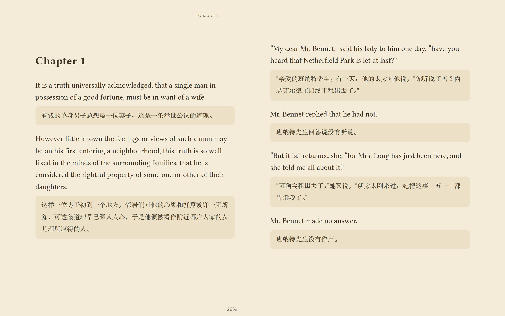
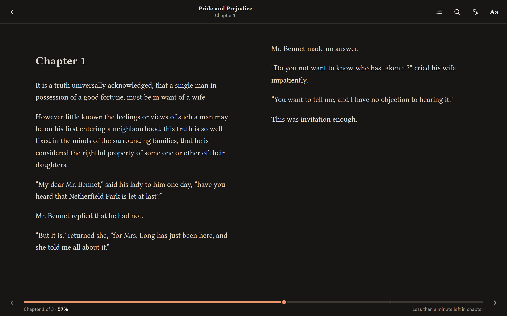

# Reader

[](https://github.com/OxO-106/epub-reader/actions/workflows/ci.yml)
[](LICENSE)

**A calm, local-first reader for your own books, with live Chinese translation by a model on your own machine.**

Reader runs on your PC and is used from any browser: your desk, your laptop, your phone. It keeps one Library and remembers where you are in every Book, so you can stop on one device and carry on on another. Nothing leaves your machines, and no account or internet connection is needed.



## Features

- **Your Library, everywhere.** EPUB, PDF, Kindle files (MOBI and AZW3, DRM-free), Markdown and plain text (UTF-8, UTF-16 and the Chinese GBK family), added by dragging files in, choosing them, or dropping them into a watched folder. Covers, sorting by recently read, title or author (Chinese by pinyin), and a Continue reading card.
- **Reading that gets out of the way.** The controls fade while you read, leaving just the chapter and your progress; a tap brings them back. Paginated or scrolling, with keyboard, click, tap and swipe page turns.
- **Know where you are.** A progress line over the whole Book with a mark at every chapter, drag it to jump, and an estimate of the time left in the chapter. Your Reading position follows you to every device.
- **Make it yours.** Four themes (Light, Sepia, Dark and true-black Black), text size that reaches every part of the Book, line spacing, margins, and fonts set for reading: Libertinus Serif, IBM Plex Sans, 京华老宋体 and more.
- **Search inside a Book**, Chinese included, with results grouped by chapter.
- **Highlights and notes.** Select text and pick one of four colours; add a note; see every highlight of a Book in reading order and export them as Markdown. They follow you to every device.
- **Live Chinese translation.** Turn on Translate in an English Book and a Chinese rendering appears under each paragraph, written by a model you run yourself (llama.cpp, Ollama, LM Studio or vLLM). Names are put into Chinese by their sound, and each Book keeps a Glossary so a name is written the same way every time; you can change any of them.
- **On your phone, even offline.** Add Reader to your iPhone or Android Home Screen over your own Tailscale network, keep Books on the phone, and read without a connection; your place and highlights sync when you are back.
- **A desktop app** for Windows: Reader in its own window, a tray icon, the translation model started (and downloaded) for you, and automatic updates.

| Library | Reading | Phone |
|---|---|---|
|  |  |  |

## Quick start

You need [Node.js](https://nodejs.org/) 24 or newer.

```bash
git clone https://github.com/OxO-106/epub-reader.git
cd epub-reader
npm install
npm start
```

Open <http://127.0.0.1:5174> and drop a Book on the page. On Windows you can instead install the [desktop app](docs/desktop.md) from the Releases page, or double-click **`Start Reader.cmd`**, which starts Reader (and translation, if set up) behind a tray icon.

## Learn more

- [Running Reader](docs/running-reader.md): starting it, the tray launcher, where your files live, the library folder, and every setting.
- [Reaching it from other devices](docs/network-access.md): your phone and other computers, over Tailscale.
- [The desktop app](docs/desktop.md): Reader in a window of its own, with the server started for you.
- [Reader on your phone](docs/phone.md): add it to the Home Screen over Tailscale HTTPS, and keep Books for reading offline.
- [Translation](docs/translation.md) and its [set-up guide](docs/translation-setup.md): running the model, and what the Reader does with it.
- [Changelog](CHANGELOG.md): what changed in each version.
- [Glossary](GLOSSARY.md) and [decision records](docs/adr/): the language and the reasoning behind the code.

## Contributing

Bug reports, ideas and pull requests are welcome: start with [CONTRIBUTING.md](CONTRIBUTING.md). Please report security problems privately, as described in [SECURITY.md](SECURITY.md). Everyone taking part follows the [Code of Conduct](CODE_OF_CONDUCT.md).

## Licence

Reader is released under the [MIT Licence](LICENSE). The fonts and libraries it includes keep their own licences; see [THIRD-PARTY-NOTICES.md](THIRD-PARTY-NOTICES.md).
